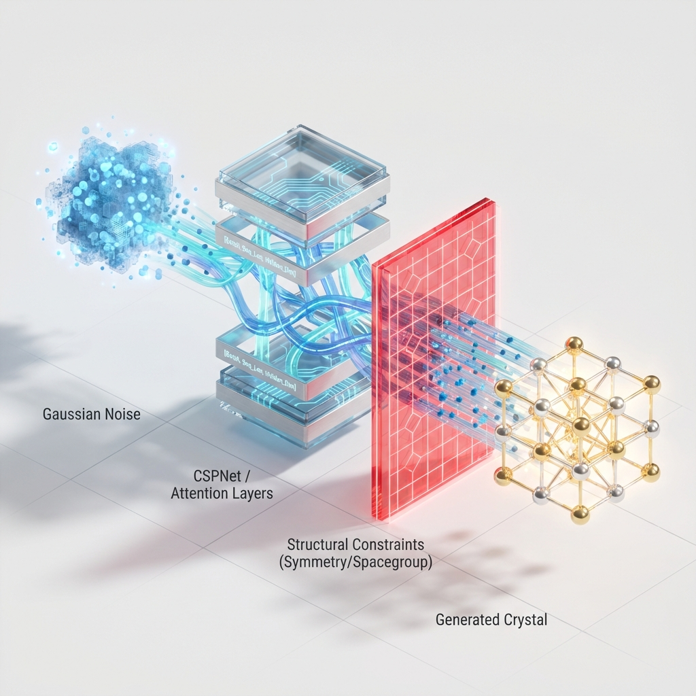

# Model Architecture

## CSPNet Diffusion Decoder

This document describes the architecture of the Crystal Structure Prediction Network (CSPNet) used as the decoder in the diffusion model.

### Schematic

### Description

The model operates as a denoising decoder within a diffusion framework. It takes noisy crystal structures and predicts their clean state (or the noise component). A key feature of this architecture is the imposition of **Structural Constraints**. The model does not simply predict arbitrary lattice parameters; instead, the output of the lattice head is projected onto a physical manifold defined by the crystal's space group. This is implemented via a mask-and-bias operation (`proj_k_to_spacegroup`), which effectively filters out degrees of freedom that violate symmetry requirements (e.g., enforcing equal lengths or 90-degree angles for cubic systems). This ensures that every generated crystal is geometrically valid by construction.

1.  **Inputs**:
    - **Atom Types**: Integer sequence representing atomic numbers, shape `[N_atoms]`.
    - **Noisy Fractional Coordinates ($X_t$)**: Noisy positions in crystal space, shape `[N_atoms, 3]`.
    - **Noisy Lattice ($L_t$)**: Noisy lattice parameters (lengths and angles), shape `[Batch, 6]`.
    - **Time Step ($t$)**: Diffusion time step, shape `[1]`.

2.  **Embedding**:
    - **Atom Embedding**: Maps atom types to a dense vector space.
    - **Time Embedding**: Uses sinusoidal positional embeddings to encode the time step, which is then concatenated with atom features.
    - **Edge Construction**: Edges are constructed based on proximity using periodic boundary conditions.

3.  **Interaction Layers (CSP Layers)**:
    - The core processing unit consists of a stack of `CSPLayer` blocks.
    - **Message Passing**: Each layer updates node features by aggregating information from neighbors.
    - **Edge MLP**: Updates edge features using connected node features, lattice information, and relative fractional coordinates (sinusoidal encoded).
    - **Node MLP**: Updates atom node features by aggregating updated edge features.
    - **Residual Connections**: Skip connections preserve information flow through the depth of the network.

4.  **Outputs**:
    - **Coordinate Head**: A linear projection predicts the update (or noise) for fractional coordinates `[N_atoms, 3]`.
    - **Lattice Head**: Graph-level pooling (mean/sum) followed by a linear projection predicts the lattice parameters `[Batch, 6]`.

This architecture allows the model to learn the complex dependencies between atomic types, positions, and the global lattice structure necessary for generating stable crystals.
