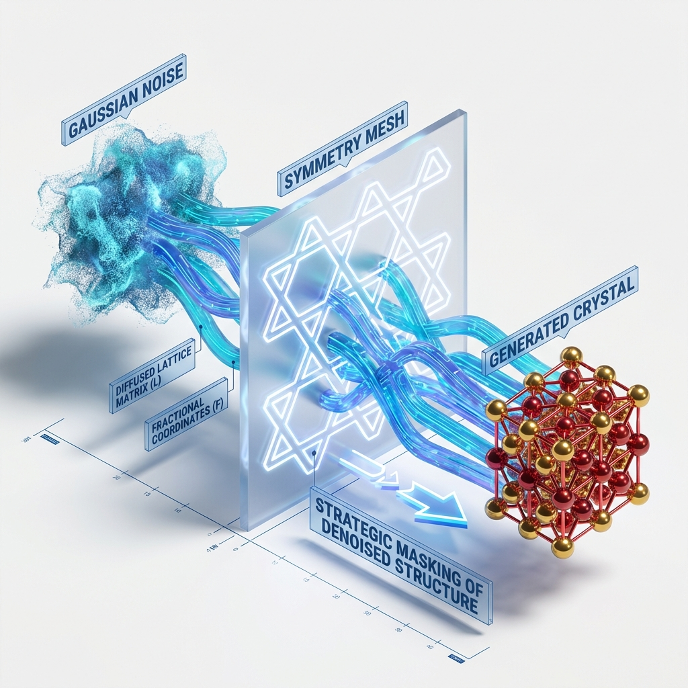
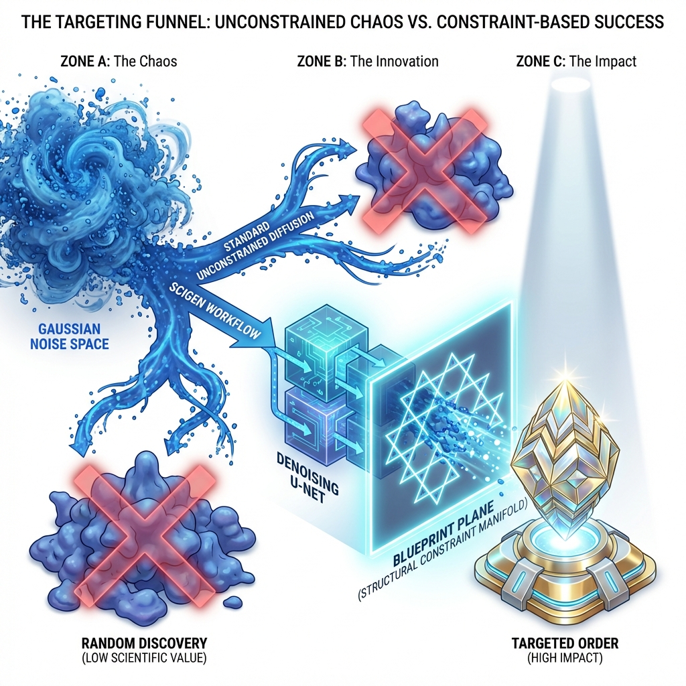
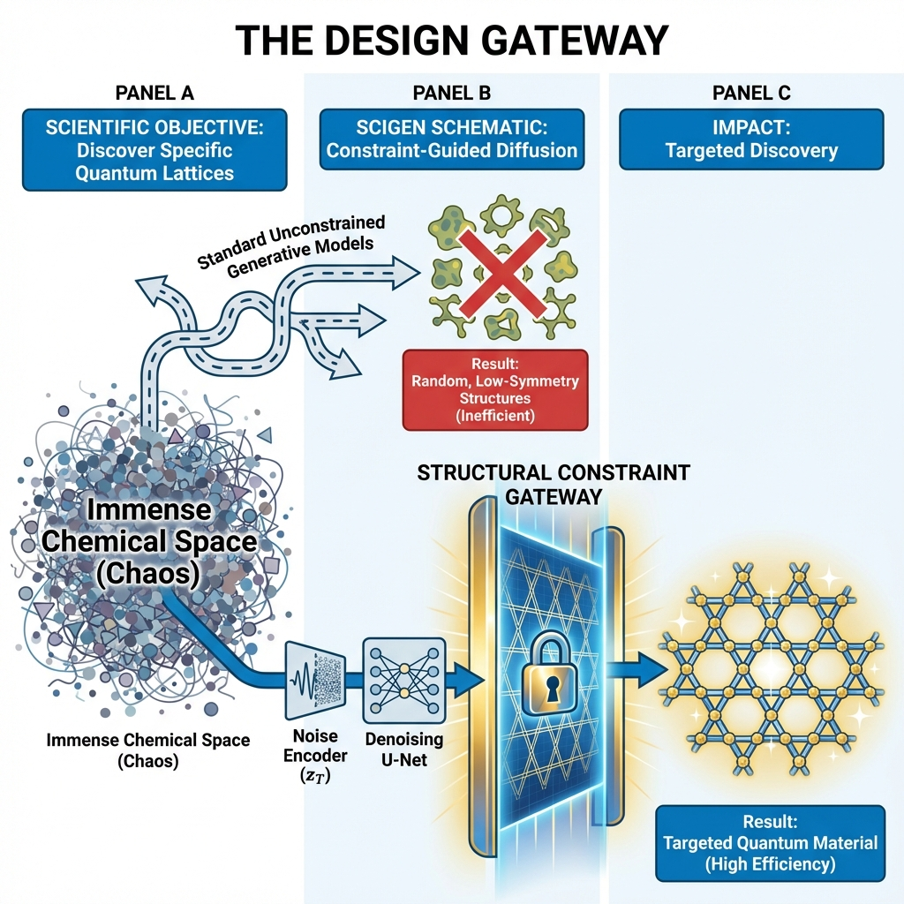

# SCIGEN Innovation: Strategic Steering via Structural Constraints

### The Concept: Conditional Sampling with Symmetry Enforcers

SCIGEN introduces a novel mechanism for **conditional sampling** that fundamentally alters how diffusion models generate materials. Instead of allowing the model to drift freely through the high-dimensional noise space, SCIGEN imposes a **"Strategic Steering"** mechanism at every timestep of the denoising process.

### Mathematical Grounding

The innovation lies in the explicit projection of the denoised state onto a validity manifold defined by the target space group. At each diffusion timestep $t$, the model predicts a denoised lattice $L_{pred}$ and fractional coordinates $F_{pred}$. Before these predictions are used to compute the next state $x_{t-1}$, they are "proof-checked" against the structural prior:

1.  **Lattice Projection**: The predicted lattice parameters are mapped to a canonical vector space and then projected:
    $$L_{constrained} = \text{proj}_{\mathcal{G}}(L_{pred}) = L_{pred} \odot M_{\mathcal{G}} + B_{\mathcal{G}}$$
    Where $M_{\mathcal{G}}$ (mask) and $B_{\mathcal{G}}$ (bias) are tensors specific to the space group $\mathcal{G}$. This operation zeros out forbidden degrees of freedom.
    
2.  **Coordinate Symmetrization**: Atomic positions are not treated as independent points but as symmetry-constrained orbits. The model uses the space group operations $O_{\mathcal{G}}$ to enforce consistency:
    $$F_{constrained} = O_{\mathcal{G}} \cdot \text{Anchor}(F_{diffused})$$
    
This approach ensures that the "Lattice Manifold" is never violated. The diffusion trajectory is effectively "steered" through the holes of a "Symmetry Mesh," forcing the chaotic noise to resolve into patterns that are strictly chemically and structurally valid, such as Kagome or Honeycomb lattices, without needing to learn these hard constraints purely from data.
# Scientific Impact: The Targeted Discovery Advantage

### The Targeting Funnel: From Chaos to Precision

### The Problem: Random Discovery Efficiency
Traditional unconstrained generative models operate in a vast, chaotic "Gaussian Noise Space." Without structural guidance, standard diffusion processes often drift into regions of the chemical search space that correspond to amorphous, unstable, or theoretically uninteresting structures. This "Random Discovery" approach suffers from low yield, as the vast majority of generated candidates must be discarded due to severe defects or lack of symmetry.

### The SCIGEN Solution: Constraint-Based Targeting
SCIGEN introduces a paradigm shift by injecting a **"Structural Constraint Manifold"** directly into the generative workflow. This acts as a high-precision filter—a "Blueprint Plane"—that the diffusion trajectory must pass through.

-   **Zone A (Chaos)**: Unconstrained diffusion leads to a pile of low-value, random blobgects.
-   **Zone B (Innovation)**: The SCIGEN workflow forces the data to conform to a specific validity manifold (e.g., a Kagome lattice blueprint). The messy noise is "snapped" into alignment during the denoising steps.
-   **Zone C (Impact)**: The result is not just a random stable crystal, but a **Targeted Order**. This guarantees that the output possesses the specific geometric properties required for advanced applications (e.g., quantum spin liquids, topological insulators), dramatically increasing the scientific yield of the generative process.
# Scientific Objective: The Design Gateway

### Comparison: Unconstrained vs. Targeted Discovery

### The Search for Order
Materials science faces an immense "Chemical Space." Searching this space randomly is inefficient. Standard generative models often produce "amorphous blobs" or structures with low symmetry that have limited physical utility.

### The SCIGEN Solution
SCIGEN introduces a **"Structural Constraint Gateway"**. This mechanism forces the generative process to respect a "Blueprint," ensuring that every output is not just a valid crystal but a *specific type* of crystal (e.g., a Kagome lattice for quantum applications). This effectively transforms the generative task from random exploration to targeted design.
