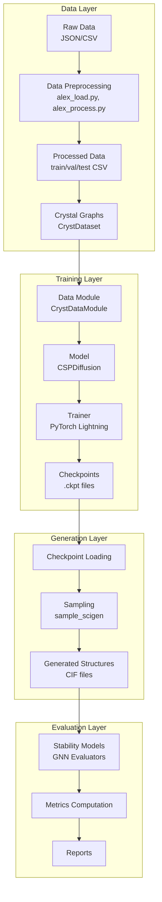
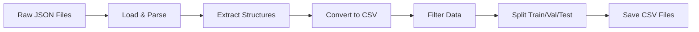
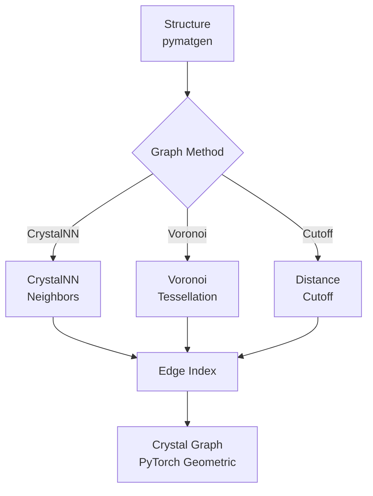
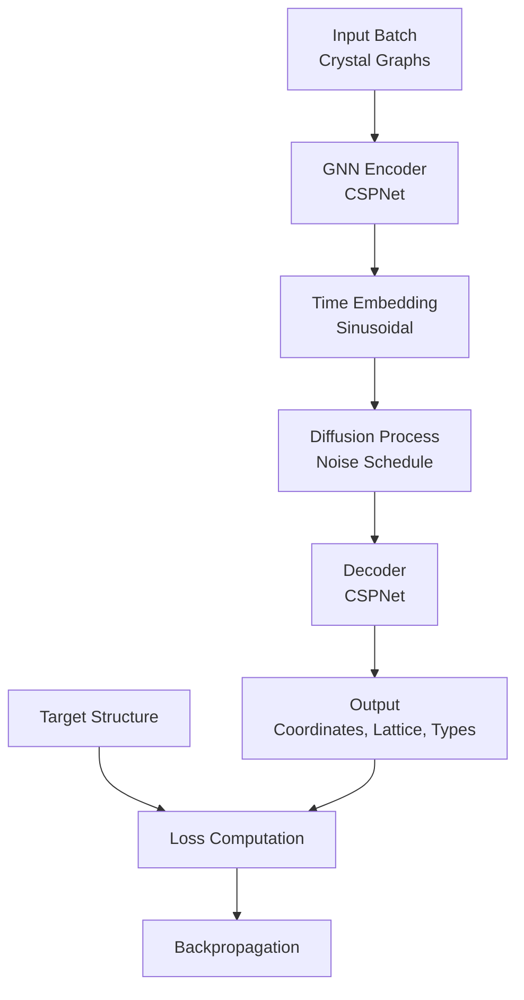
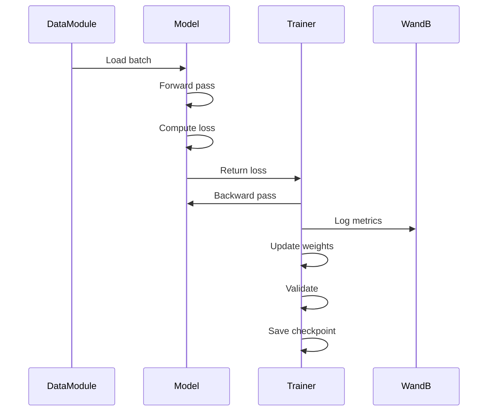
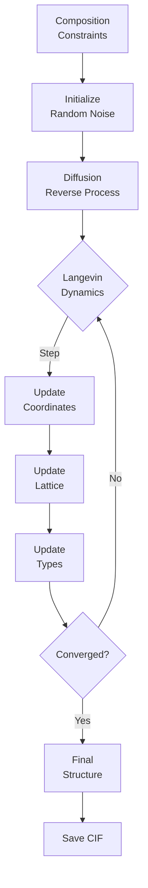
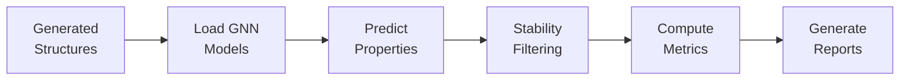
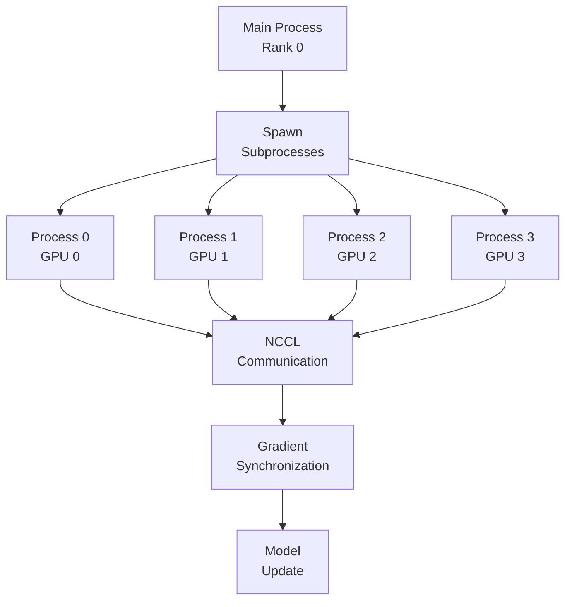

# Architecture Documentation

This document describes the system architecture, data flow, and key components of SCIGEN_p_agent.

## System Overview

SCIGEN_p_agent is a crystal structure generation system based on denoising diffusion probabilistic models (DDPM). The system consists of several interconnected components for data preparation, training, generation, and evaluation.

## High-Level Architecture



## Component Details

### Data Layer

#### Data Preprocessing Pipeline



**Components**:
- `data_prep/alex_load.py`: Downloads and converts raw data
- `data_prep/alex_process.py`: Filters and splits data

#### Crystal Graph Construction



**Graph Building Methods**:
- **CrystalNN**: Uses coordination number and distance
- **Voronoi**: Voronoi tessellation-based
- **Cutoff**: Simple distance cutoff

### Training Layer

#### Model Architecture



**Key Components**:
- **Encoder**: Graph neural network (CSPNet) for structure encoding
- **Time Embedding**: Sinusoidal embeddings for diffusion timesteps
- **Diffusion Process**: Forward and reverse diffusion with noise schedules
- **Decoder**: Generates coordinates, lattice parameters, and atom types

#### Training Flow



### Generation Layer

#### Sampling Process



**Sampling Steps**:
1. Initialize with random noise
2. Iteratively denoise using learned model
3. Apply Langevin dynamics for refinement
4. Output final crystal structure

### Evaluation Layer

#### Evaluation Pipeline



## Data Flow

### Training Data Flow

```
CSV Files (train.csv)
    ↓
CrystDataset.__getitem__()
    ↓
Load Structure → Build Graph → Normalize
    ↓
PyTorch Geometric Data
    ↓
DataLoader (batched)
    ↓
Model Forward Pass
    ↓
Loss Computation
    ↓
Backward Pass & Optimization
```

### Generation Data Flow

```
Checkpoint File
    ↓
Load Model
    ↓
Composition Constraints
    ↓
Sample Function
    ↓
Diffusion Reverse Process
    ↓
Generated Structure
    ↓
Save CIF File
```

## Key Modules

### `scigen/pl_modules/diffusion_w_type.py`

**CSPDiffusion Class**: Main diffusion model

- **Forward Pass**: Computes loss for training
- **Sample Function**: Generates structures
- **Training/Validation Steps**: PyTorch Lightning hooks

### `scigen/pl_data/datamodule.py`

**CrystDataModule Class**: Data management

- **Setup**: Instantiates datasets
- **DataLoaders**: Provides batched data
- **Scalers**: Normalizes data

### `scigen/common/data_utils.py`

**Utility Functions**:
- `build_crystal_graph()`: Constructs graph from structure
- `cart_to_frac_coords()`: Coordinate transformations
- `lattice_params_to_matrix_torch()`: Lattice conversions

## Configuration System

### Hydra Configuration Hierarchy

```
conf/default.yaml
    ├── data/default.yaml (or mp_20.yaml, alex_2d.yaml)
    ├── model/diffusion_w_type.yaml
    ├── train/default.yaml (or multi_gpu.yaml)
    ├── optim/default.yaml
    └── logging/default.yaml
```

### Environment Variables

```
.env file
    ├── PROJECT_ROOT: Project directory
    ├── HYDRA_JOBS: Hydra output directory
    └── WANDB_DIR: WandB directory
```

## Multi-GPU Architecture

### Distributed Training Flow



**Process Coordination**:
- Main process (rank 0) spawns subprocesses
- Each subprocess handles one GPU
- NCCL coordinates gradient synchronization
- All processes update models identically

## File Organization

```
SCIGEN_p_agent/
├── scigen/              # Core training code
│   ├── run.py           # Main entry point
│   ├── pl_modules/      # Model definitions
│   ├── pl_data/         # Data loading
│   └── common/          # Utilities
├── data_prep/           # Data preparation
├── scripts/             # Generation/evaluation scripts
├── conf/                # Hydra configurations
├── data/                # Processed datasets
└── docs/                # Documentation
```

## Dependencies

### Core Dependencies
- **PyTorch**: Deep learning framework
- **PyTorch Lightning**: Training framework
- **PyTorch Geometric**: Graph neural networks
- **pymatgen**: Crystal structure manipulation
- **Hydra**: Configuration management

### Optional Dependencies
- **WandB**: Experiment tracking
- **matminer**: Materials informatics
- **pyxtal**: Crystal symmetry

## Performance Considerations

### Memory Management
- Data is cached after first load
- Batch size affects memory usage
- Multi-GPU reduces memory per GPU

### Computational Efficiency
- Graph building can be cached
- On-the-fly graph building (otf_graph) for large datasets
- Multi-GPU provides near-linear speedup

## Extension Points

### Adding New Models
1. Create new model class in `scigen/pl_modules/`
2. Inherit from `BaseModule`
3. Implement required methods
4. Add config in `conf/model/`

### Adding New Datasets
1. Create data config in `conf/data/`
2. Ensure CSV format matches expected schema
3. Update data preprocessing if needed

### Adding New Evaluation Metrics
1. Add metric computation in `scripts/evaluation/`
2. Integrate with evaluation pipeline
3. Update documentation

## See Also

- [Workflow Guide](WORKFLOW.md): Complete workflow documentation
- [API Documentation](API.md): Detailed function documentation
- [Configuration Guide](CONFIGURATION.md): Configuration options


