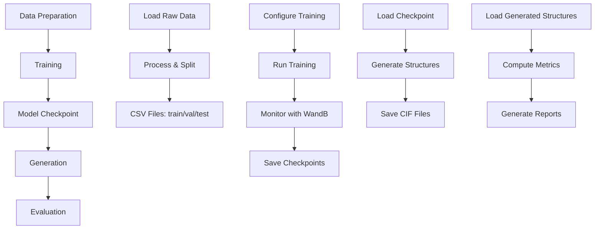

# SCIGEN Workflow Guide

This document provides a complete guide to the SCIGEN workflow, from data preparation through training, generation, and evaluation.

## Workflow Overview



## Phase 1: Data Preparation

### 1.1 Load Raw Data

For Alexandria dataset:

**Script**: `data_prep/alex_load.py`

**Purpose**: Downloads and converts raw JSON data from Alexandria database to CSV format.

**Usage**:
```bash
# Interactive
python data_prep/alex_load.py

# Or via SLURM job script
sbatch scripts/jobs/data_prep/alex_load.sh
```

**What it does**:
- Downloads compressed JSON files from Alexandria database
- Extracts crystal structure information
- Converts to CSV format with columns: `material_id`, `formation_energy_per_atom`, `cif`, `elements`, etc.
- Saves individual CSV files per data chunk

**Output**: CSV files in `data/alex_2d/` (or `data/alex_3d/`)

**Configuration**: Edit `data_prep/config_data.py` to change dataset type or parameters.

### 1.2 Process and Split Data

**Script**: `data_prep/alex_process.py`

**Purpose**: Processes CSV files, filters data, and creates train/val/test splits.

**Usage**:
```bash
# Interactive
python data_prep/alex_process.py

# Or via SLURM job script
sbatch scripts/jobs/data_prep/alex_process.sh
```

**What it does**:
- Loads all CSV files from data directory
- Applies filters (formation energy, energy above hull, number of atoms)
- Splits data into train/val/test sets (typically 80/10/10)
- Generates visualization plots
- Saves final CSV files: `train.csv`, `val.csv`, `test.csv`

**Output**: 
- `data/alex_2d/train.csv`
- `data/alex_2d/val.csv`
- `data/alex_2d/test.csv`
- Visualization plots in data directory

**Configuration**: Edit thresholds in `alex_process.py`:
```python
threshold_lower_dict = {
    'formation_energy_per_atom': 2.0,
    'e_above_hull': 0.3,
    'natm': 41
}
```

### 1.3 Verify Data

Check that data files exist and have correct format:

```bash
# Check file existence
ls -lh data/alex_2d/*.csv

# Check data statistics
python -c "import pandas as pd; df = pd.read_csv('data/alex_2d/train.csv'); print(f'Train: {len(df)} samples')"
```

## Phase 2: Training

### 2.1 Configure Training

Training is configured via Hydra configuration files in `conf/`:

**Key configuration files**:
- `conf/data/`: Dataset configurations (mp_20.yaml, alex_2d.yaml)
- `conf/model/`: Model architectures (diffusion_w_type.yaml, diffusion.yaml)
- `conf/train/`: Training settings (default.yaml, multi_gpu.yaml)
- `conf/optim/`: Optimizer settings (default.yaml)

**Example**: Training on Alexandria 2D dataset with diffusion model

```bash
python scigen/run.py \
    data=alex_2d \
    model=diffusion_w_type \
    expname=alex2d_experiment \
    train.pl_trainer.max_epochs=500
```

### 2.2 Single-GPU Training

**Command**:
```bash
python scigen/run.py \
    data=mp_20 \
    model=diffusion_w_type \
    expname=my_experiment
```

**Or use job script**:
```bash
sbatch scripts/jobs/training/single_gpu.sh
```

**What happens**:
1. Loads configuration from `conf/`
2. Instantiates data module (loads and preprocesses data)
3. Instantiates model (diffusion model with GNN encoder)
4. Sets up PyTorch Lightning Trainer
5. Trains model with automatic checkpointing
6. Runs validation and testing
7. Logs metrics to WandB (if configured)

**Output**: 
- Checkpoints in `hydra_outputs/singlerun/YYYY-MM-DD/expname/`
- WandB logs (if enabled)
- Training logs

### 2.3 Multi-GPU Training

**For 2 GPUs**:
```bash
python scigen/run.py \
    data=alex_2d \
    model=diffusion_w_type \
    expname=alex2d_2gpu \
    train.pl_trainer.devices=2 \
    train.pl_trainer.strategy=ddp
```

**For 4 GPUs** (recommended for Perlmutter):
```bash
sbatch scripts/jobs/training/multi_gpu_4gpu.sh
```

**Or use command-line**:
```bash
python scigen/run.py \
    data=alex_2d \
    model=diffusion_w_type \
    expname=alex2d_4gpu \
    train.pl_trainer.devices=4 \
    train.pl_trainer.strategy=ddp
```

**Key points**:
- Uses Distributed Data Parallel (DDP) strategy
- Automatically splits batch across GPUs
- Effective batch size = `batch_size × num_gpus`
- Near-linear speedup with multiple GPUs

**See**: [Multi-GPU Setup Guide](multi_gpu_setup_report_2026-01-13.md) for detailed information.

### 2.4 Monitor Training

**WandB Dashboard**:
- Training/validation loss curves
- Learning rate schedule
- Model gradients and parameters
- System metrics (GPU utilization, memory)

**Log Files**:
- SLURM output: `slurm/scigen_py312_*.log`
- SLURM errors: `slurm/scigen_py312_*.err`
- Hydra outputs: `hydra_outputs/singlerun/.../run.log`

**Checkpoints**:
- Best model: `epoch=X-step=Y-val_loss=Z.ckpt`
- Last checkpoint: `last.ckpt` (if enabled)
- Saved in Hydra output directory

### 2.5 Resume Training

Training automatically resumes from the latest checkpoint if found in the output directory:

```bash
# Training will automatically detect and load checkpoint
python scigen/run.py \
    data=alex_2d \
    model=diffusion_w_type \
    expname=alex2d_experiment
```

## Phase 3: Generation

### 3.1 Prepare Generation Script

**Script**: `scripts/generation/generation.py` (or `gen_mul.py` for batch generation)

**Purpose**: Generate crystal structures from a trained model.

### 3.2 Single Generation Run

**Command**:
```bash
python scripts/generation/generation.py \
    --model_path /path/to/checkpoint.ckpt \
    --dataset mp_20 \
    --label my_generation \
    --sc pyc \
    --batch_size 20 \
    --num_batches_to_samples 50 \
    --natm_range 88 88 \
    --known_species Mn Fe Co Ni
```

**Parameters**:
- `--model_path`: Path to trained checkpoint
- `--dataset`: Dataset name (for scaler loading)
- `--label`: Unique label for this generation run
- `--sc`: Structure constraint (pyc, kag, hon, etc.)
- `--batch_size`: Number of structures per batch
- `--num_batches_to_samples`: Number of batches to generate
- `--natm_range`: Range of atoms in unit cell (min max)
- `--known_species`: List of allowed atomic species

**Output**:
- Generated structures in `hydra_outputs/.../gen_<label>.pt`
- Trajectory files (if `--save_traj` enabled)

### 3.3 Batch Generation

**Script**: `gen_mul.py`

**Purpose**: Generate multiple structure types in batch.

**Usage**:
```python
# Edit gen_mul.py to configure:
sc_list = ['pyc', 'kag', 'hon']  # Structure constraints
atom_list = ['Mn', 'Fe', 'Co', 'Ni']  # Allowed species
batch_size = 20
num_batches_to_samples = 50

# Run
python gen_mul.py
```

### 3.4 Save CIF Files

**Script**: `scripts/generation/save_cif.py`

**Purpose**: Convert generated structures to CIF format.

**Usage**:
```bash
python scripts/generation/save_cif.py \
    --job_dir /path/to/hydra/output \
    --label my_generation
```

**Output**: CIF files in `hydra_outputs/.../gen_<label>_cif/`

## Phase 4: Evaluation

### 4.1 Stability Evaluation

**Script**: `scripts/evaluation/eval_screen.py`

**Purpose**: Evaluate generated structures for stability using GNN models.

**Usage**:
```bash
python scripts/evaluation/eval_screen.py \
    --job_dir /path/to/hydra/output \
    --label my_generation \
    --screen_mag  # Include magnetic evaluation
```

**What it does**:
1. Loads generated structures
2. Evaluates stability using pre-trained GNN models
3. Filters structures based on stability criteria
4. Generates evaluation reports

**Output**:
- Evaluation results: `eval_gen_<label>.pt`
- Filtered structures
- Stability statistics

### 4.2 Compute Metrics

**Script**: `scripts/evaluation/compute_metrics.py`

**Purpose**: Compute various metrics on generated structures.

**Metrics**:
- Formation energy distribution
- Energy above hull
- Structure diversity
- Composition distribution

**Usage**:
```bash
python scripts/evaluation/compute_metrics.py \
    --results_dir /path/to/generated/structures
```

### 4.3 Visualization

**Script**: `scripts/visualization/traj_movie.py`

**Purpose**: Create visualization movies of generation trajectories.

**Usage**:
```bash
python scripts/visualization/traj_movie.py \
    --traj_file /path/to/trajectory.pt \
    --output_dir /path/to/output
```

## Complete Example Workflow

### Example 1: Full Pipeline for Alexandria 2D

```bash
# 1. Data preparation
sbatch scripts/jobs/data_prep/alex_load.sh
sbatch scripts/jobs/data_prep/alex_process.sh

# 2. Training (4 GPUs)
sbatch scripts/jobs/training/alex2d_4gpu.sh

# 3. Generation
python scripts/generation/generation.py \
    --model_path hydra_outputs/.../best.ckpt \
    --dataset alex_2d \
    --label alex2d_gen \
    --sc pyc \
    --batch_size 20 \
    --num_batches_to_samples 100

# 4. Save CIF files
python scripts/generation/save_cif.py \
    --job_dir hydra_outputs/... \
    --label alex2d_gen

# 5. Evaluation
python scripts/evaluation/eval_screen.py \
    --job_dir hydra_outputs/... \
    --label alex2d_gen
```

### Example 2: Quick Test Run

```bash
# 1. Train on small subset (debug mode)
python scigen/run.py \
    data=mp_20 \
    model=diffusion_w_type \
    expname=test_run \
    train.pl_trainer.fast_dev_run=True

# 2. Generate small batch
python scripts/generation/generation.py \
    --model_path hydra_outputs/.../checkpoint.ckpt \
    --dataset mp_20 \
    --label test_gen \
    --sc van \
    --batch_size 5 \
    --num_batches_to_samples 2
```

## Troubleshooting

### Data Preparation Issues

**Problem**: CSV files not created
- **Solution**: Check data directory permissions, verify JSON files downloaded correctly

**Problem**: Data processing fails with memory error
- **Solution**: Reduce `preprocess_workers` in config, process in smaller chunks

### Training Issues

**Problem**: Out of memory (OOM) errors
- **Solution**: Reduce `batch_size` in data config, use gradient accumulation

**Problem**: Training loss not decreasing
- **Solution**: Check learning rate, verify data preprocessing, check for data leaks

**Problem**: Multi-GPU training fails
- **Solution**: See [Multi-GPU Setup Guide](multi_gpu_setup_report_2026-01-13.md) for troubleshooting

### Generation Issues

**Problem**: Generated structures are invalid
- **Solution**: Check model checkpoint, verify scaler files, check generation parameters

**Problem**: Generation is slow
- **Solution**: Reduce `num_batches_to_samples`, use GPU for generation, optimize batch size

### Evaluation Issues

**Problem**: Evaluation models not found
- **Solution**: Check `gnn_eval/models/` directory, verify model paths in config

**Problem**: Evaluation fails with shape mismatch
- **Solution**: Verify generated structure format, check data preprocessing consistency

## Best Practices

1. **Data Preparation**:
   - Always verify data splits before training
   - Check for data quality issues (missing values, outliers)
   - Save intermediate results for debugging

2. **Training**:
   - Start with small experiments (fast_dev_run) to verify setup
   - Monitor training with WandB
   - Save checkpoints regularly
   - Use validation set to tune hyperparameters

3. **Generation**:
   - Generate in batches for efficiency
   - Save trajectories for analysis
   - Verify generated structures before evaluation

4. **Evaluation**:
   - Use multiple evaluation metrics
   - Compare against baseline structures
   - Document evaluation results

## Next Steps

- See [API Documentation](API.md) for detailed function documentation
- See [Configuration Guide](CONFIGURATION.md) for configuration options
- See [Architecture](ARCHITECTURE.md) for system design details


