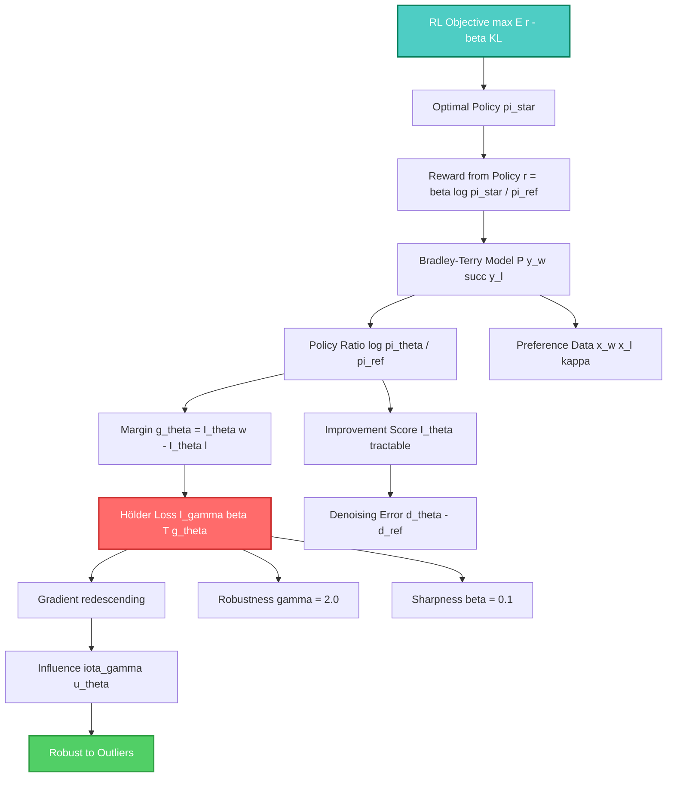
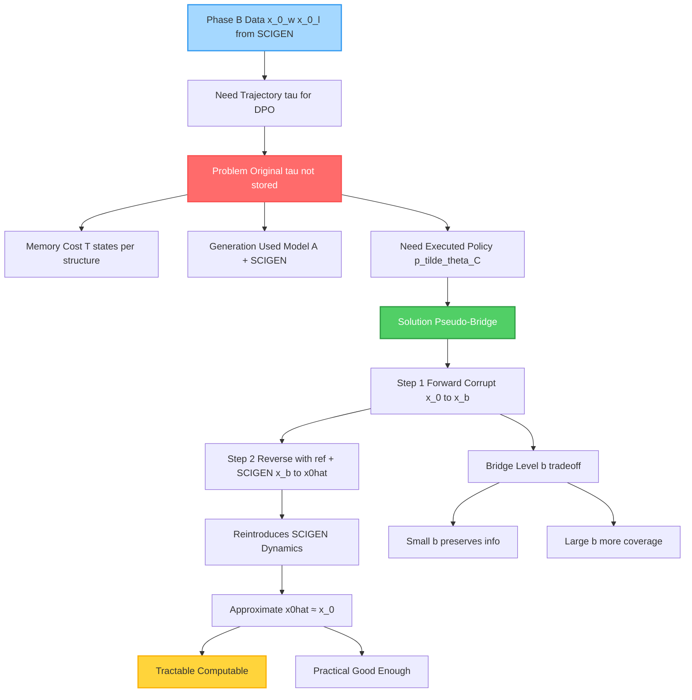
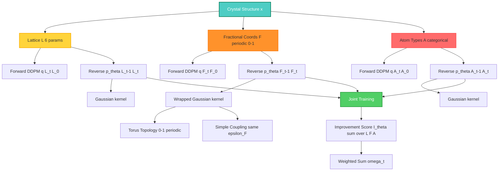
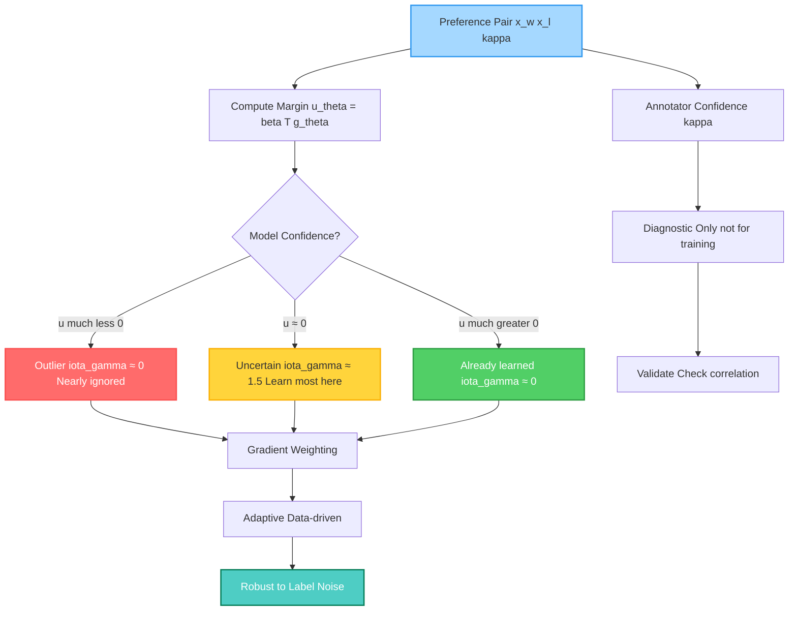
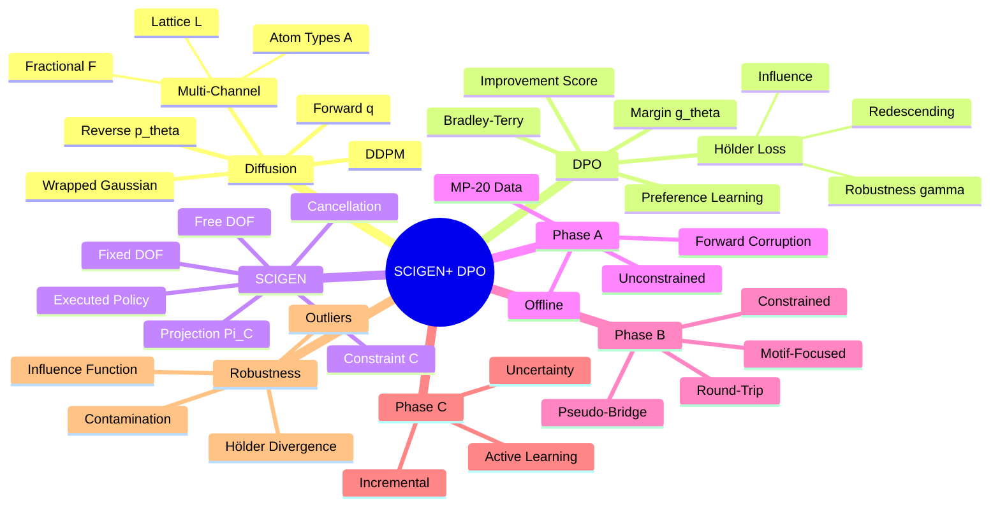

# SCIGEN+ DPO Concept Map - Mermaid Diagrams

> **Purpose:** Visual overview of all key concepts and their relationships
> **Format:** Multiple Mermaid diagrams for different aspects
> **Audience:** For understanding the big picture

---

## 🗺️ MAIN CONCEPT MAP: Complete Overview

```mermaid
graph TB
    %% Main goal
    SCIGENP[SCIGEN+ Flat Band Materials Discovery]

    %% Three main components
    DIFFUSION[Crystal Diffusion DiffCSP++]
    DPO[Preference Learning Direct Preference Optimization]
    SCIGEN[Structural Constraints SCIGEN Projection]

    SCIGENP --> DIFFUSION
    SCIGENP --> DPO
    SCIGENP --> SCIGEN

    %% Diffusion details
    DIFFUSION --> CHANNELS[Multi-Channel Diffusion]
    CHANNELS --> L_CHANNEL[Lattice L DDPM]
    CHANNELS --> F_CHANNEL[Fractional Coords F Wrapped Gaussian]
    CHANNELS --> A_CHANNEL[Atom Types A DDPM]

    %% DPO details
    DPO --> HOLDER[Hölder-DPO Robust Training]
    DPO --> MARGIN[DPO Margin g_theta t]
    MARGIN --> IMPROVEMENT[Improvement Score I_theta x t]
    IMPROVEMENT --> DENOISING[Denoising Errors d_theta d_ref]

    HOLDER --> GAMMA[Robustness Param gamma = 2.0]
    HOLDER --> REDESCEND[Redescending Outlier Down-weighting]

    %% SCIGEN details
    SCIGEN --> PROJECTION[Projection Pi_C]
    PROJECTION --> FREE[Free DOF Model Controls]
    PROJECTION --> FIXED[Fixed DOF Motif Values]

    %% Three phases
    SCIGENP --> PHASES[Three-Phase Training]
    PHASES --> PHASEA[Phase A Offline DPO]
    PHASES --> PHASEB[Phase B Motif-Focused]
    PHASES --> PHASEC[Phase C Active Learning]

    %% Phase A
    PHASEA --> MP20[MP-20 Dataset Clean Crystals]
    PHASEA --> FORWARD[Forward Corruption x_t from q]
    PHASEA --> UNCONSTRAINED[No SCIGEN during training]

    %% Phase B
    PHASEB --> BRIDGE[Bridge Formulation Pseudo-Bridge]
    PHASEB --> EXECUTED[Executed Policy p_tilde_theta_C]
    PHASEB --> CONSTRAINED[SCIGEN Active during training]

    BRIDGE --> RECONSTRUCTION[Bridge Reconstruction x0 to xb to x0hat]
    BRIDGE --> BRIDGELEVEL[Bridge Level b Partial Rollout]

    EXECUTED --> CANCELLATION[Constraint Cancellation Lemma 3.1]
    CANCELLATION --> FREELOSS[Loss on Free DOF Only]

    %% Phase C
    PHASEC --> UNCERTAINTY[Uncertainty Sampling]
    PHASEC --> NOVELTY[Novelty Detection]

    %% Key concepts
    IMPROVEMENT --> TRACTABLE[Tractable Proxy Single-Timestep]
    F_CHANNEL --> TORUS[Torus Topology 0-1 periodic]
    F_CHANNEL --> WRAPPED[Wrapped Distance Delta F G]

    DENOISING --> COUPLING[Simple Coupling Same epsilon_F]

    %% Data flow
    PHASEA -.->|fine-tune| PHASEB
    PHASEB -.->|fine-tune| PHASEC

    %% Styling
    classDef mainGoal fill:#ff6b6b,stroke:#c92a2a,stroke-width:3px,color:#fff
    classDef phase fill:#4ecdc4,stroke:#087f5b,stroke-width:2px,color:#fff
    classDef method fill:#95e1d3,stroke:#0ca678,stroke-width:2px
    classDef math fill:#ffd93d,stroke:#f59f00,stroke-width:2px
    classDef data fill:#b8e6f7,stroke:#1971c2,stroke-width:2px

    class SCIGENP mainGoal
    class PHASEA,PHASEB,PHASEC phase
    class DIFFUSION,DPO,SCIGEN method
    class MARGIN,IMPROVEMENT,DENOISING,HOLDER math
    class MP20,BRIDGE,EXECUTED data
```



---

## 🔄 TRAINING PIPELINE: Three-Phase Flow


---

## 🧮 DPO MATHEMATICS: From RL to Loss



---

## 🌉 PHASE B BRIDGE FORMULATION: Why Needed?



---

## 🏗️ MULTI-CHANNEL DIFFUSION: Crystal Structure



---

## 🎯 HÖLDER ROBUSTNESS: Down-weighting Outliers



---

## 📊 CONSTRAINT CANCELLATION: Free vs Fixed DOF

```mermaid
graph LR
    INPUT[Model Proposal u_t-1 from p_theta]

    INPUT --> SCIGEN[SCIGEN Projection Pi_C]
    SCIGEN --> FREE[Free DOF u_free kept]
    SCIGEN --> FIXED[Fixed DOF x_C_star_fix overwritten]

    FREE --> EXECUTED_FREE[Executed p_tilde free components]
    FIXED --> EXECUTED_FIXED[Executed indicator fixed = motif]

    EXECUTED_FREE --> RATIO[Log-Ratio for DPO]
    EXECUTED_FIXED --> RATIO

    RATIO --> CANCEL[Indicators Cancel in ratio]
    CANCEL --> RESULT[Only Free DOF in loss]

    RESULT --> MASK[Masked Residual C_bar_eff odot r_theta]
    MASK --> NORM[Normalized Error divide by num free]

    NORM --> FAIR[Fair Comparison across constraints]

    style INPUT fill:#a5d8ff,stroke:#339af0,stroke-width:2px
    style SCIGEN fill:#4ecdc4,stroke:#087f5b,stroke-width:2px,color:#fff
    style FREE fill:#51cf66,stroke:#2f9e44,stroke-width:2px,color:#fff
    style FIXED fill:#868e96,stroke:#495057,stroke-width:2px,color:#fff
    style CANCEL fill:#ffd43b,stroke:#fab005,stroke-width:2px
    style FAIR fill:#ff922b,stroke:#fd7e14,stroke-width:2px
```



---

## 🔑 KEY TERMINOLOGY: Quick Reference



---

## 📖 How to Use These Diagrams

### 1. **Main Concept Map**
- Start here for complete overview
- See how all pieces fit together
- Identify which topics to study deeper

### 2. **Training Pipeline**
- Understand data flow through phases
- See how models improve iteratively
- Follow generation → annotation → training loop

### 3. **DPO Mathematics**
- Trace derivation from RL to loss
- Understand why improvement scores work
- See Hölder robustness integration

### 4. **Phase B Bridge**
- Understand why pseudo-bridge needed
- See reconstruction process
- Connect to constraint cancellation

### 5. **Multi-Channel Diffusion**
- Understand per-channel formulations
- See why different channels need different treatment
- Connect to joint training

### 6. **Hölder Robustness**
- Visualize adaptive weighting
- Understand outlier down-weighting
- Compare to confidence κ

### 7. **Constraint Cancellation**
- See free vs fixed decomposition
- Understand why only train on free DOF
- Connect to masking in loss

---

## 🎨 Rendering Instructions

To render these Mermaid diagrams:

### Option 1: GitHub/GitLab
- Push this file to GitHub/GitLab
- Diagrams render automatically in preview

### Option 2: Mermaid Live Editor
- Go to https://mermaid.live/
- Copy-paste each diagram
- Export as PNG/SVG

### Option 3: VS Code
- Install "Markdown Preview Mermaid Support" extension
- Open this file
- Preview renders diagrams

### Option 4: Command Line
```bash
# Install mermaid-cli
npm install -g @mermaid-js/mermaid-cli

# Render to PNG
mmdc -i CONCEPT_MAP_MERMAID_FIXED.md -o concept_map.png

# Render to SVG
mmdc -i CONCEPT_MAP_MERMAID_FIXED.md -o concept_map.svg -t neutral
```

---

## 🔗 Cross-References

- **Detailed explanations:** See [reading_session_2026-03-16_DETAILED.md](reading_session_2026-03-16_DETAILED.md)
- **Mathematical derivations:** See [DERIVATIONS_ANNOTATED.md](DERIVATIONS_ANNOTATED.md)
- **Notation clarifications:** See [VOICE_TRANSCRIPT_CLARIFICATIONS.md](VOICE_TRANSCRIPT_CLARIFICATIONS.md)
- **Quick Q&A:** See [reading_session_2026-03-16.md](reading_session_2026-03-16.md)

---

## 💡 Tips for Understanding

1. **Start with Main Concept Map** → Get the big picture
2. **Follow Training Pipeline** → Understand data flow
3. **Trace DPO Mathematics** → See derivation logic
4. **Study Phase B Bridge** → Understand why it's complex
5. **Check Terminology Mindmap** → Quick reference

**Color coding:**
- 🔴 **Red** = Problems/Challenges
- 🟢 **Green** = Solutions/Methods
- 🟡 **Yellow** = Intermediate steps
- 🔵 **Blue** = Data/Input
- 🟣 **Purple** = Final results

---

**Note:** This is a fixed version with ASCII-safe characters instead of Unicode symbols (θ, ε, etc.) to ensure proper Mermaid rendering.
