# SCIGEN+ DPO Concept Map - Mermaid Diagrams

> **Purpose:** Visual overview of all key concepts and their relationships
> **Format:** Multiple Mermaid diagrams for different aspects
> **Audience:** For understanding the big picture

---

## 🗺️ MAIN CONCEPT MAP: Complete Overview

```mermaid
graph TB
    %% Main goal
    SCIGENP[SCIGEN+<br/>Flat Band Materials<br/>Discovery]

    %% Three main components
    DIFFUSION[Crystal Diffusion<br/>DiffCSP++]
    DPO[Preference Learning<br/>Direct Preference Optimization]
    SCIGEN[Structural Constraints<br/>SCIGEN Projection]

    SCIGENP --> DIFFUSION
    SCIGENP --> DPO
    SCIGENP --> SCIGEN

    %% Diffusion details
    DIFFUSION --> CHANNELS[Multi-Channel<br/>Diffusion]
    CHANNELS --> L_CHANNEL[Lattice L<br/>DDPM]
    CHANNELS --> F_CHANNEL[Fractional Coords F<br/>Wrapped Gaussian]
    CHANNELS --> A_CHANNEL[Atom Types A<br/>DDPM]

    %% DPO details
    DPO --> HOLDER[Hölder-DPO<br/>Robust Training]
    DPO --> MARGIN[DPO Margin<br/>g_θ(t)]
    MARGIN --> IMPROVEMENT[Improvement Score<br/>I_θ(x,t)]
    IMPROVEMENT --> DENOISING[Denoising Errors<br/>d_θ, d_ref]

    HOLDER --> GAMMA[Robustness Param<br/>γ = 2.0]
    HOLDER --> REDESCEND[Redescending<br/>Outlier Down-weighting]

    %% SCIGEN details
    SCIGEN --> PROJECTION[Projection Π_C]
    PROJECTION --> FREE[Free DOF<br/>Model Controls]
    PROJECTION --> FIXED[Fixed DOF<br/>Motif Values]

    %% Three phases
    SCIGENP --> PHASES[Three-Phase<br/>Training]
    PHASES --> PHASEA[Phase A<br/>Offline DPO]
    PHASES --> PHASEB[Phase B<br/>Motif-Focused]
    PHASES --> PHASEC[Phase C<br/>Active Learning]

    %% Phase A
    PHASEA --> MP20[MP-20 Dataset<br/>Clean Crystals]
    PHASEA --> FORWARD[Forward Corruption<br/>x_t ~ q(x_t|x_0)]
    PHASEA --> UNCONSTRAINED[No SCIGEN<br/>during training]

    %% Phase B
    PHASEB --> BRIDGE[Bridge Formulation<br/>Pseudo-Bridge]
    PHASEB --> EXECUTED[Executed Policy<br/>p̃_{θ,C}]
    PHASEB --> CONSTRAINED[SCIGEN Active<br/>during training]

    BRIDGE --> RECONSTRUCTION[Bridge Reconstruction<br/>x_0 → x_b → x̂_0]
    BRIDGE --> BRIDGELEVEL[Bridge Level b<br/>Partial Rollout]

    EXECUTED --> CANCELLATION[Constraint Cancellation<br/>Lemma 3.1]
    CANCELLATION --> FREELOSS[Loss on Free DOF Only]

    %% Phase C
    PHASEC --> UNCERTAINTY[Uncertainty<br/>Sampling]
    PHASEC --> NOVELTY[Novelty<br/>Detection]

    %% Key concepts
    IMPROVEMENT --> TRACTABLE[Tractable Proxy<br/>Single-Timestep]
    F_CHANNEL --> TORUS[Torus Topology<br/>[0,1)^(N×3)]
    F_CHANNEL --> WRAPPED[Wrapped Distance<br/>Δ(F,G)]

    DENOISING --> COUPLING[Simple Coupling<br/>Same ε_F]

    %% Data flow
    PHASEA -.->|fine-tune| PHASEB
    PHASEB -.->|fine-tune| PHASEC

    %% Styling
    classDef mainGoal fill:#ff6b6b,stroke:#c92a2a,stroke-width:3px,color:#fff
    classDef phase fill:#4ecdc4,stroke:#087f5b,stroke-width:2px,color:#fff
    classDef method fill:#95e1d3,stroke:#0ca678,stroke-width:2px
    classDef math fill:#ffd93d,stroke:#f59f00,stroke-width:2px
    classDef data fill:#b8e6f7,stroke:#1971c2,stroke-width:2px

    class SCIGENP mainGoal
    class PHASEA,PHASEB,PHASEC phase
    class DIFFUSION,DPO,SCIGEN method
    class MARGIN,IMPROVEMENT,DENOISING,HOLDER math
    class MP20,BRIDGE,EXECUTED data
```

---

## 🔄 TRAINING PIPELINE: Three-Phase Flow

```mermaid
flowchart LR
    %% Input data
    START([Start:<br/>Pretrained<br/>DiffCSP++])

    %% Phase A
    START --> A_DATA[(Phase A Data<br/>MP-20 DFT<br/>800-1500 materials<br/>3500-5000 pairs)]

    A_DATA --> A_TRAIN[Phase A Training<br/>Unconstrained H-DPO<br/>γ=2.0, β=0.1]

    A_TRAIN --> A_MODEL{{Model θ_A<br/>General Flat Band<br/>Preference}}

    %% Phase B
    A_MODEL --> B_GEN[Generate with<br/>θ_A + SCIGEN]
    B_GEN --> B_SCREEN[Screen:<br/>CHGNet Stability<br/>DFT Band Structure]
    B_SCREEN --> B_ANNOTATE[Human Annotation<br/>band_eval_web<br/>w/confidence κ]

    B_ANNOTATE --> B_DATA[(Phase B Data<br/>Per-motif<br/>300-800 structures<br/>1500-4200 pairs)]

    B_DATA --> B_TRAIN[Phase B Training<br/>Bridge H-DPO<br/>Lower LR<br/>Pseudo-bridge]

    B_TRAIN --> B_MODEL{{Model θ_B<br/>Motif-Specific<br/>Preferences}}

    %% Phase C
    B_MODEL --> C_GEN[Generate Batch]
    C_GEN --> C_SELECT[Active Selection<br/>Uncertainty<br/>+ Novelty<br/>+ Disagreement]
    C_SELECT --> C_ANNOTATE[Expert Query<br/>High-value pairs]

    C_ANNOTATE --> C_DATA[(Phase C Data<br/>50-100 pairs/round<br/>×5 rounds)]

    C_DATA --> C_TRAIN[Incremental Training]
    C_TRAIN --> C_MODEL{{Model θ_C<br/>Refined<br/>Preferences}}

    C_MODEL -.->|iterate| C_GEN

    %% Final output
    C_MODEL --> END([Final Model:<br/>Generate Flat Band<br/>Materials])

    %% Styling
    classDef phaseA fill:#ffd93d,stroke:#f59f00,stroke-width:2px
    classDef phaseB fill:#95e1d3,stroke:#0ca678,stroke-width:2px
    classDef phaseC fill:#ff6b6b,stroke:#c92a2a,stroke-width:2px
    classDef data fill:#b8e6f7,stroke:#1971c2,stroke-width:2px
    classDef model fill:#b197fc,stroke:#7950f2,stroke-width:2px

    class A_DATA,A_TRAIN phaseA
    class B_GEN,B_SCREEN,B_ANNOTATE,B_DATA,B_TRAIN phaseB
    class C_GEN,C_SELECT,C_ANNOTATE,C_DATA,C_TRAIN phaseC
    class A_MODEL,B_MODEL,C_MODEL model
```



---

## 🧮 DPO MATHEMATICS: From RL to Loss

```mermaid
graph TB
    %% Start
    START[RL Objective:<br/>max E[r] - β·KL]

    %% Optimal policy
    START --> OPTIMAL[Optimal Policy π*:<br/>π* ∝ π_ref · exp(r/β)]

    %% Reward extraction
    OPTIMAL --> REWARD[Reward Formula:<br/>r = β log(π*/π_ref) + C]

    %% Bradley-Terry
    REWARD --> BT[Bradley-Terry:<br/>P(w≻ℓ) = σ(r_w - r_ℓ)]

    %% Substitute
    BT --> SUBSTITUTE[Substitute r:<br/>P(w≻ℓ) = σ(β log[π_θ(w)/π_ref(w)]<br/>- β log[π_θ(ℓ)/π_ref(ℓ)])]

    %% DPO loss
    SUBSTITUTE --> DPOLOSS[DPO Loss:<br/>L = -E[log σ(...)]]

    %% For diffusion: intractable
    DPOLOSS --> INTRACTABLE{Diffusion:<br/>log p_θ(x_0)<br/>Intractable?}

    INTRACTABLE -->|Yes| PROXY[Use Proxy:<br/>Single-timestep<br/>log-ratio]

    %% Improvement score
    PROXY --> LOGRATIO[Log-ratio:<br/>log p_θ(x_t-1|x_t) /<br/>log p_ref(x_t-1|x_t)]

    LOGRATIO --> GAUSSIAN{Kernel<br/>Type?}

    GAUSSIAN -->|DDPM<br/>L,A| DDPM[Reparameterize:<br/>μ_θ = f(x_t, ε_θ)]
    GAUSSIAN -->|Torus<br/>F| WRAPPED[Wrapped Gaussian:<br/>Δ(F, μ_θ)]

    DDPM --> NOISE[Noise Error:<br/>d_θ = ||ε - ε_θ||²]
    WRAPPED --> PERIODICERR[Periodic Error:<br/>d_θ^(F) = ||Δ(F,μ_θ)||²]

    NOISE --> IMPROVE
    PERIODICERR --> IMPROVE[Improvement Score:<br/>I_θ = ω_t(d_ref - d_θ)]

    %% Margin
    IMPROVE --> MARGIN[DPO Margin:<br/>g_θ(t) = I_θ(x^w,t) - I_θ(x^ℓ,t)]

    %% Final loss
    MARGIN --> FINALLOSS[Diffusion-DPO:<br/>L = -E[log σ(β·T·g_θ(t))]]

    %% Hölder variant
    FINALLOSS --> HOLDER{Noisy<br/>Labels?}
    HOLDER -->|Yes| HOLDERDPO[Hölder-DPO:<br/>L = E[ℓ_γ(β·T·g_θ(t))]<br/>γ=2.0]

    HOLDERDPO --> REDESCEND[Redescending:<br/>∂ℓ_γ/∂x → 0<br/>as x → -∞]

    %% Styling
    classDef start fill:#ffd93d,stroke:#f59f00,stroke-width:2px
    classDef math fill:#95e1d3,stroke:#0ca678,stroke-width:2px
    classDef decision fill:#ff6b6b,stroke:#c92a2a,stroke-width:2px
    classDef final fill:#b197fc,stroke:#7950f2,stroke-width:3px

    class START start
    class OPTIMAL,REWARD,BT,SUBSTITUTE,DPOLOSS,PROXY math
    class INTRACTABLE,GAUSSIAN,HOLDER decision
    class HOLDERDPO,REDESCEND final
```

---

## 🌉 PHASE B BRIDGE FORMULATION: Why Needed?

```mermaid
graph TB
    %% Problem
    PROBLEM[Problem:<br/>Phase B data from<br/>SCIGEN generation]

    PROBLEM --> ENDPOINTS[Only Endpoints Stored:<br/>x_0^w, x_0^ℓ]
    PROBLEM --> NOTRAJECTORY[Trajectories NOT Stored:<br/>Too much space<br/>~GB]

    %% What we need
    ENDPOINTS --> NEED[Need for DPO:<br/>Evaluate executed policy<br/>p̃_θ,C(x_0)]

    NEED --> ENDPOINTRATIO[Endpoint Log-Ratio:<br/>Δ_θ,C(x_0) =<br/>log p̃_θ,C(x_0) / p̃_ref,C(x_0)]

    %% Bridge identity
    ENDPOINTRATIO --> IDENTITY[Endpoint-to-Bridge<br/>Identity:<br/>Proposition 3.2]

    IDENTITY --> FORMULA[Δ_θ,C(x_0) = log E_τ[exp(Σ_t Λ_θ,C(τ,t))]]

    FORMULA --> BRIDGEDIST[Need: Bridge Distribution<br/>q*_C(τ|x_0) = p̃_ref,C(τ|x_0)]

    %% Problem: don't have bridge
    BRIDGEDIST --> NOHAVE{Have<br/>Bridge?}
    NOHAVE -->|No| SOLUTION[Solution:<br/>Pseudo-Bridge<br/>Reconstruction]

    %% Pseudo-bridge
    SOLUTION --> STEP1[1. Sample Level:<br/>b ~ ρ(·)<br/>e.g. Uniform(1,T)]
    STEP1 --> STEP2[2. Forward Noise:<br/>x_b ~ q(x_b|x_0)<br/>Add noise to endpoint]
    STEP2 --> STEP3[3. Reverse Rollout:<br/>Run ref+SCIGEN<br/>for b steps:<br/>x_b → ... → x̂_0]
    STEP3 --> RESULT[Result:<br/>Pseudo-Bridge τ̂<br/>x̂_0 ≠ x_0 but close!]

    %% Use it
    RESULT --> COMPUTE[Compute Improvement<br/>on Pseudo-Bridge:<br/>I_θ,C^(z),BR(τ̂,t)]

    COMPUTE --> MARGIN[Bridge Margin:<br/>g_θ,C^BR(t;b)]

    MARGIN --> LOSS[Bridge H-DPO Loss:<br/>L = E[ℓ_γ(β·b·g_θ,C^BR(t;b))]]

    %% Key insight
    LOSS --> INSIGHT[Key Insight:<br/>Reintroduces SCIGEN<br/>dynamics in training!]

    %% Constraint cancellation
    INSIGHT --> CANCEL[Constraint Cancellation<br/>Lemma 3.1]
    CANCEL --> FREELOSS[Only Train on<br/>Free DOF:<br/>C̄ ⊙ (x̂_t-1 - μ_θ)]

    %% Styling
    classDef problem fill:#ff6b6b,stroke:#c92a2a,stroke-width:2px
    classDef solution fill:#95e1d3,stroke:#0ca678,stroke-width:2px
    classDef step fill:#ffd93d,stroke:#f59f00,stroke-width:2px
    classDef final fill:#b197fc,stroke:#7950f2,stroke-width:3px

    class PROBLEM,ENDPOINTS,NOTRAJECTORY problem
    class SOLUTION,RESULT,COMPUTE solution
    class STEP1,STEP2,STEP3 step
    class LOSS,INSIGHT,FREELOSS final
```

---

## 🏗️ MULTI-CHANNEL DIFFUSION: Crystal Structure

```mermaid
graph LR
    %% Crystal representation
    CRYSTAL[Crystal Structure<br/>x_0 = L,F,A]

    %% Three channels
    CRYSTAL --> L[Lattice L<br/>3×3 matrix]
    CRYSTAL --> F[Fractional Coords F<br/>[0,1)^N×3]
    CRYSTAL --> A[Atom Types A<br/>One-hot R^h×N]

    %% Lattice
    L --> LINV[O(3)-Invariant:<br/>k = (k_1,...,k_6)]
    LINV --> LSPACE[Space Group:<br/>Some k_i fixed<br/>m ∈ {0,1}^6]
    LSPACE --> LDDPM[Forward: DDPM<br/>q(k_t|k_0)]
    LDDPM --> LREVERSE[Reverse: Gaussian<br/>p_θ(k_t-1|k_t)]
    LREVERSE --> LERROR[Error:<br/>m ⊙ (ε - ε_θ^(L))]

    %% Fractional
    F --> FTORUS[Torus Topology:<br/>0.0 ≡ 1.0]
    FTORUS --> FWRAP[Wrapped Normal:<br/>q(F_t|F_0)]
    FWRAP --> FREVERSE[Reverse Proxy:<br/>N_w(F_t-1; μ_θ^(F), σ̃²I)]
    FREVERSE --> FERROR[Error:<br/>||Δ(F_t-1, μ_θ^(F))||²]

    %% Atom types
    A --> AONEHOT[One-hot Embedding<br/>h elements]
    AONEHOT --> ADDPM[Forward: DDPM<br/>q(A_t|A_0)]
    ADDPM --> AREVERSE[Reverse: Gaussian<br/>p_θ(A_t-1|A_t)]
    AREVERSE --> AERROR[Error:<br/>||ε - ε_θ^(A)||²]

    %% Combine
    LERROR --> JOINT[Joint Loss:<br/>λ_k·L_k + λ_F·L_F + λ_A·L_A]
    FERROR --> JOINT
    AERROR --> JOINT

    JOINT --> MODEL[Shared Denoising<br/>Network φ(M_t,t)]

    MODEL --> OUTPUTS[Outputs:<br/>ε̂_θ^(L), ε̂_θ^(F), ε̂_θ^(A)]

    %% Styling
    classDef channel fill:#ffd93d,stroke:#f59f00,stroke-width:2px
    classDef process fill:#95e1d3,stroke:#0ca678,stroke-width:2px
    classDef final fill:#b197fc,stroke:#7950f2,stroke-width:2px

    class L,F,A channel
    class LDDPM,FWRAP,ADDPM,LREVERSE,FREVERSE,AREVERSE process
    class JOINT,MODEL,OUTPUTS final
```

---

## 🎯 HÖLDER ROBUSTNESS: Down-weighting Outliers

```mermaid
graph TB
    %% Input
    INPUT[Preference Pair:<br/>x^w, x^ℓ, κ]

    INPUT --> MARGIN[Compute Margin:<br/>u_θ(s) = β·T·g_θ(t)]

    %% Decision
    MARGIN --> PROB[Model Belief:<br/>p = σ(u_θ)]

    PROB --> CASES{Model<br/>Confidence?}

    %% Case 1: Strong disagreement (outlier)
    CASES -->|u ≪ 0<br/>p ≈ 0| OUTLIER[Potential Outlier:<br/>Model disagrees<br/>with label]

    OUTLIER --> INFLUENCE1[Influence Weight:<br/>ι_γ(u) = p^γ(1-p)²<br/>≈ 0^2 · 1 = 0]

    INFLUENCE1 --> EFFECT1[Effect:<br/>Nearly ignored<br/>in training!]

    %% Case 2: Uncertain
    CASES -->|u ≈ 0<br/>p ≈ 0.5| UNCERTAIN[Uncertain:<br/>Model unsure]

    UNCERTAIN --> INFLUENCE2[Influence Weight:<br/>ι_γ(0) ≈ 1.5<br/>Maximum!]

    INFLUENCE2 --> EFFECT2[Effect:<br/>Learn most<br/>from these!]

    %% Case 3: Strong agreement
    CASES -->|u ≫ 0<br/>p ≈ 1| CONFIDENT[Already Learned:<br/>Model confident]

    CONFIDENT --> INFLUENCE3[Influence Weight:<br/>ι_γ(u) = 1^2 · 0² = 0]

    INFLUENCE3 --> EFFECT3[Effect:<br/>Already knows,<br/>don't reinforce!]

    %% Gradient
    EFFECT1 --> GRAD[Gradient:<br/>∂L/∂θ = -ι_γ(u) · ∂u/∂θ]
    EFFECT2 --> GRAD
    EFFECT3 --> GRAD

    GRAD --> ADAPTIVE[Adaptive Weighting:<br/>Changes during training<br/>as model learns]

    %% Compare to κ
    INPUT --> KAPPA[Annotator Confidence κ:<br/>NOT used in loss!]
    KAPPA --> DIAGNOSTIC[Only for:<br/>Diagnostics<br/>Tuning γ<br/>Validation]

    %% Final
    ADAPTIVE --> ROBUST[Robust Training:<br/>Automatic outlier<br/>detection!]

    %% Styling
    classDef input fill:#b8e6f7,stroke:#1971c2,stroke-width:2px
    classDef case fill:#ffd93d,stroke:#f59f00,stroke-width:2px
    classDef outlier fill:#ff6b6b,stroke:#c92a2a,stroke-width:2px
    classDef uncertain fill:#95e1d3,stroke:#0ca678,stroke-width:2px
    classDef confident fill:#b197fc,stroke:#7950f2,stroke-width:2px
    classDef final fill:#4ecdc4,stroke:#087f5b,stroke-width:3px

    class INPUT,KAPPA input
    class OUTLIER,INFLUENCE1,EFFECT1 outlier
    class UNCERTAIN,INFLUENCE2,EFFECT2 uncertain
    class CONFIDENT,INFLUENCE3,EFFECT3 confident
    class ROBUST,ADAPTIVE final
```

---

## 📊 CONSTRAINT CANCELLATION: Free vs Fixed DOF

```mermaid
graph LR
    %% Input
    INPUT[Model Proposal:<br/>u_t-1 ~ p_θ(·|x_t)]

    INPUT --> PI[SCIGEN Projection:<br/>Π_C(u_t-1)]

    %% Decomposition
    PI --> FREE[Free Components:<br/>u_t-1^free<br/>Model controls]
    PI --> FIXED[Fixed Components:<br/>x_C^⋆,fix<br/>Motif values]

    FREE --> OUTPUT1[Keep from<br/>Proposal]
    FIXED --> OUTPUT2[Overwrite with<br/>Constraint]

    OUTPUT1 --> RESULT[Executed Output:<br/>x_t-1 = u^free, x_C^⋆,fix]
    OUTPUT2 --> RESULT

    %% Executed kernel
    RESULT --> KERNEL[Executed Kernel:<br/>p̃_θ,C(x_t-1|x_t)]

    KERNEL --> FACTORIZE[Factorize:<br/>= 1[x^fix = x_C^⋆,fix]<br/>· p_θ(x^free|x_t)]

    %% Log-ratio
    FACTORIZE --> LOGRATIO[Log-Ratio:<br/>log p̃_θ,C / p̃_ref,C]

    LOGRATIO --> NUMERATE[Numerator:<br/>1[·] · p_θ(x^free)]
    LOGRATIO --> DENOMINATOR[Denominator:<br/>1[·] · p_ref(x^free)]

    NUMERATE --> CANCEL{Indicator<br/>Same?}
    DENOMINATOR --> CANCEL

    CANCEL -->|Yes!| SIMPLIFIED[Simplified:<br/>log p_θ(x^free) /<br/>log p_ref(x^free)]

    %% Implication
    SIMPLIFIED --> IMPLICATION[Implication:<br/>Only free DOF<br/>in log-ratio!]

    %% Training
    IMPLICATION --> MASK[Apply Free Mask:<br/>C̄ = 1 - C]

    MASK --> RESIDUAL[Masked Residual:<br/>r_θ = C̄ ⊙ x̂_t-1 - μ_θ]

    RESIDUAL --> NORMALIZE[Normalize:<br/>d_θ = ||r_θ||² / (||C̄||_1 + ε_0)]

    NORMALIZE --> TRAIN[Train Only on<br/>Unconstrained<br/>Components!]

    %% But...
    TRAIN --> NOTE[Note: Bridge distribution<br/>still depends on<br/>SCIGEN dynamics!]

    %% Styling
    classDef input fill:#b8e6f7,stroke:#1971c2,stroke-width:2px
    classDef free fill:#95e1d3,stroke:#0ca678,stroke-width:2px
    classDef fixed fill:#ff6b6b,stroke:#c92a2a,stroke-width:2px
    classDef math fill:#ffd93d,stroke:#f59f00,stroke-width:2px
    classDef final fill:#b197fc,stroke:#7950f2,stroke-width:3px

    class INPUT,OUTPUT1,OUTPUT2 input
    class FREE,MASK,RESIDUAL,NORMALIZE free
    class FIXED fixed
    class LOGRATIO,SIMPLIFIED math
    class TRAIN,NOTE final
```

---

## 🔑 KEY TERMINOLOGY: Quick Reference

```mermaid
mindmap
  root((SCIGEN+ DPO))
    Diffusion
      Forward: q x_t|x_0
      Reverse: p_θ x_t-1|x_t
      DDPM: Lattice L, Atom A
      Wrapped: Fractional F
      Predictor-Corrector
      Tractable Proxy

    DPO
      Bradley-Terry Model
      Log-ratio: π_θ/π_ref
      Improvement Score I_θ
      Margin g_θ t
      Single-timestep Proxy
      Denoising Error d_θ

    Hölder-DPO
      Hölder Loss ℓ_γ
      γ = 2.0 default
      Redescending
      Influence ι_γ
      Outlier Down-weight
      NOT use κ in loss

    SCIGEN
      Projection Π_C
      Constraint C
      Free DOF: Model controls
      Fixed DOF: Motif values
      Cancellation Lemma 3.1
      Executed Policy p̃_θ,C

    Phase A
      MP-20 Data
      Unconstrained
      Forward Corruption
      General Preferences

    Phase B
      Bridge Formulation
      Pseudo-Bridge τ̂
      Bridge Level b
      Round-trip x_0→x_b→x̂_0
      Executed Training
      Motif-Specific

    Phase C
      Active Learning
      Uncertainty Sampling
      Novelty Detection
      Expert Query

    Math Concepts
      Torus [0,1)^N×3
      Wrapped Distance Δ F,G
      Simple Coupling: same ε_F
      Trajectory τ
      Kernel = transition prob
      Tractable = closed-form
```

---

## 📖 How to Use These Diagrams

### 1. **Main Concept Map**
   - Start here for complete overview
   - See how all pieces fit together
   - Identify which topics to study deeper

### 2. **Training Pipeline**
   - Understand data flow through phases
   - See how models improve iteratively
   - Follow generation → annotation → training loop

### 3. **DPO Mathematics**
   - Trace derivation from RL to loss
   - Understand why improvement scores work
   - See Hölder robustness integration

### 4. **Phase B Bridge**
   - Understand why pseudo-bridge needed
   - See reconstruction process
   - Connect to constraint cancellation

### 5. **Multi-Channel Diffusion**
   - Understand per-channel formulations
   - See why different channels need different treatment
   - Connect to joint training

### 6. **Hölder Robustness**
   - Visualize adaptive weighting
   - Understand outlier down-weighting
   - Compare to confidence κ

### 7. **Constraint Cancellation**
   - See free vs fixed decomposition
   - Understand why only train on free DOF
   - Connect to masking in loss

---

## 🎨 Rendering Instructions

To render these Mermaid diagrams:

### Option 1: GitHub/GitLab
- Push this file to GitHub/GitLab
- Diagrams render automatically in preview

### Option 2: Mermaid Live Editor
- Go to https://mermaid.live/
- Copy-paste each diagram
- Export as PNG/SVG

### Option 3: VS Code
- Install "Markdown Preview Mermaid Support" extension
- Open this file
- Preview renders diagrams

### Option 4: Command Line
```bash
# Install mermaid-cli
npm install -g @mermaid-js/mermaid-cli

# Render to PNG
mmdc -i CONCEPT_MAP_MERMAID.md -o concept_map.png

# Render to SVG
mmdc -i CONCEPT_MAP_MERMAID.md -o concept_map.svg -t neutral
```

---

## 🔗 Cross-References

- **Detailed explanations:** See `reading_session_2026-03-16_DETAILED.md`
- **Mathematical derivations:** See `DERIVATIONS_ANNOTATED.md`
- **Notation clarifications:** See `VOICE_TRANSCRIPT_CLARIFICATIONS.md`
- **Quick Q&A:** See `reading_session_2026-03-16.md`

---

## 💡 Tips for Understanding

1. **Start with Main Concept Map** → Get the big picture
2. **Follow Training Pipeline** → Understand data flow
3. **Trace DPO Mathematics** → See derivation logic
4. **Study Phase B Bridge** → Understand why it's complex
5. **Check Terminology Mindmap** → Quick reference

**Color coding:**
- 🔴 Red = Problems/Challenges
- 🟢 Green = Solutions/Methods
- 🟡 Yellow = Intermediate steps
- 🔵 Blue = Data/Input
- 🟣 Purple = Final results
